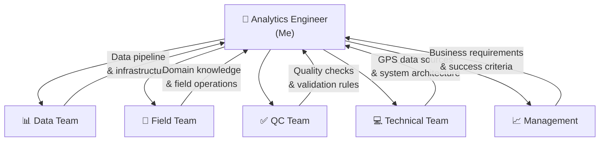
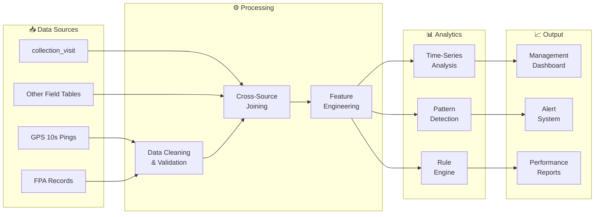
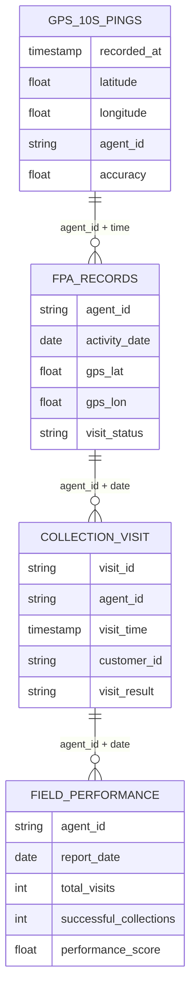
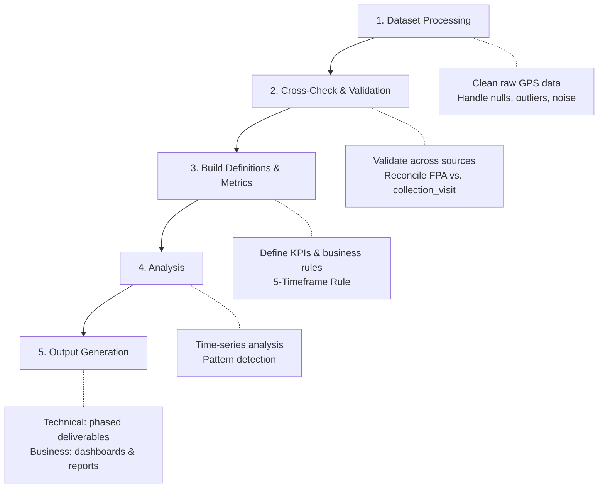
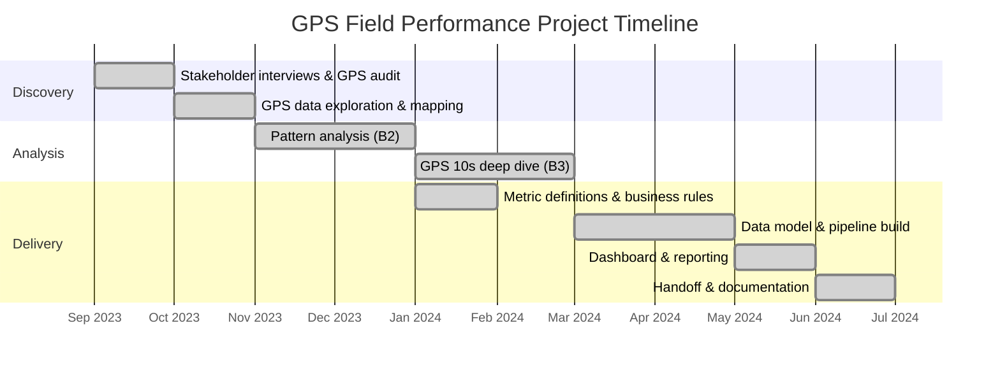

# 📍 GPS Field Performance Analytics

> **Turning untapped GPS data into actionable field team insights — reducing visit fraud and empowering management visibility.**

<!-- Badges — update these with your actual tech stack -->


---

## 📋 Executive Summary

In early 2023, regulatory changes in the lending industry triggered a wave of customer lawsuits, exposing significant gaps in how **Field teams** (field collection agents) were being monitored. Management lacked visibility into daily field activities — the only tools available were a basic performance dashboard and a single visit table.

This project discovered that **GPS data had been collected but never utilized**, and through cross-functional collaboration with Field, QC, Technical, and Management stakeholders, I built an end-to-end analytics solution that:

- **Uncovered visit fraud patterns** — agents logging visits only seconds apart at impossible distances
- **Defined business rules** (e.g., the 5-Timeframe Rule) to enforce legitimate visit behavior
- **Delivered time-series analytics** enabling real-time monitoring of field team performance

---

## 📑 Table of Contents

- [Business Context & Problem Statement](#-business-context--problem-statement)
- [Stakeholder Discovery & Collaboration](#-stakeholder-discovery--collaboration)
- [Data Discovery & Exploration](#-data-discovery--exploration)
- [Business Rules & Definitions](#-business-rules--definitions)
- [Technical Architecture](#-technical-architecture)
- [Methodology & Analysis Approach](#-methodology--analysis-approach)
- [Key Findings & Outputs](#-key-findings--outputs)
- [Impact & Results](#-impact--results)
- [Project Phases & Timeline](#-project-phases--timeline)
- [Lessons Learned](#-lessons-learned)
- [How to Run / Reproduce](#-how-to-run--reproduce)
- [Repository Structure](#-repository-structure)
- [Documentation](#-documentation)

---

## 🏢 Business Context & Problem Statement

> 📖 *For a detailed deep-dive, see [docs/business_context.md](docs/business_context.md)*

### The Situation (As-Is)

| Timeline | Event |
|---|---|
| **Early 2023** | Regulatory/legal changes in the lending industry |
| | Customers began filing lawsuits against collection practices |
| | Field teams operated in a chaotic, unmonitored environment |
| **Late 2023** | Management demanded visibility: *"What are Field teams actually doing?"* |

### The Gap

The existing tooling was insufficient:

- ✅ **Available**: A Field Performance dashboard with basic KPIs
- ✅ **Available**: One `collection_visit` table recording visit logs
- ❌ **Missing**: No GPS-based behavioral analysis
- ❌ **Missing**: No fraud/gaming detection
- ❌ **Missing**: No way to verify if visits were legitimate

### The Opportunity

Inside the existing datasets, **GPS columns had been collected but never used**. This represented an untapped goldmine of spatial-temporal data that could answer:

1. Where are field agents actually going?
2. Are visits happening at real customer locations?
3. Are visit patterns legitimate or gamed?

---

## 🤝 Stakeholder Discovery & Collaboration

> **Analytics Engineering is not just about data — it's about people.** This section highlights the cross-functional collaboration that was essential to this project.

### Stakeholder Map



### Discovery Phase (B1) — GPS Data Audit

Through conversations with each stakeholder group, I uncovered critical gaps:

| Stakeholder | Finding |
|---|---|
| **Field & QC** | Only used **2 columns** from the `collection_visit` table. GPS data was essentially ignored. |
| **Technical** | Confirmed that **full GPS records existed in FPA** (Field Performance Application) for every day — but had never been surfaced to analytics. |
| **Data Team** | No one had mapped GPS columns to business meaning or cross-referenced them with other Field domain tables. |

> **Key Insight**: The data existed. The problem was that no one had connected the dots across teams.

---

## 🔍 Data Discovery & Exploration

> 📖 *For data definitions, see [docs/data_dictionary.md](docs/data_dictionary.md)*

### Understanding GPS Columns

The first step was understanding what the GPS columns actually meant:

- **What do the GPS coordinates represent?** (Agent location? Customer location? Check-in point?)
- **How do they relate to other columns** in the same table?
- **What links exist** between GPS data and other tables in the Field domain?

### Phase B2 — Pattern Analysis with GPS + FPA Data

By joining GPS data from FPA with the `collection_visit` table and other Field domain tables, I analyzed:

| Analysis | Question | Finding |
|---|---|---|
| **Visit Distance** | How far apart are consecutive visits? | Some visits showed physically impossible distances for the time elapsed |
| **Visit Duration** | How long does each visit take? | Many visits lasted only seconds — far too short for legitimate collection activity |
| **Visit Spacing** | How are visits distributed throughout the day? | **Pattern detected**: clusters of visits only seconds apart, suggesting gaming/fraud |

### Phase B3 — GPS 10-Second Data Deep Dive

To validate findings, I explored the **GPS 10-second interval data** — granular GPS pings recorded every 10 seconds from field agents' devices:

- Connected multiple datasets: FPA, Field tables, `collection_visit`
- Built a behavioral assessment framework for Field Performance Agents
- Evaluated movement patterns, idle times, and route authenticity

---

## 📏 Business Rules & Definitions

> 📖 *For complete metric definitions and formulas, see [docs/metrics_definitions.md](docs/metrics_definitions.md)*

### The 5-Timeframe Rule

The most significant business rule to emerge from this analysis:

> **Rule**: Field agent visits must be **spread across 5 defined time frames** throughout the working day. Clustered visits within a single time frame are flagged as potentially fraudulent.

This rule was derived directly from the pattern analysis in Phase B2, where we discovered agents logging dozens of visits within minutes.

### Metric Categories

| Category | Examples |
|---|---|
| **Visit Legitimacy** | Visit duration, inter-visit distance, GPS accuracy radius |
| **Coverage & Compliance** | Timeframe spread, daily visit count, unique locations visited |
| **Performance** | Collection success rate by visit quality, productive vs. non-productive visits |
| **Behavioral Flags** | Rapid successive visits, stationary GPS with multiple check-ins, after-hours activity |

---

## 🏗️ Technical Architecture

> 📖 *For detailed technical documentation, see [docs/technical_architecture.md](docs/technical_architecture.md)*

### High-Level Data Flow



### Tech Stack

<!-- 🔧 UPDATE THIS with your actual tech stack -->

| Layer | Technology | Purpose |
|---|---|---|
| **Data Warehouse** | *[e.g., BigQuery / Snowflake]* | Central data storage |
| **Transformation** | *[e.g., dbt / SQL]* | Data modeling & business logic |
| **Orchestration** | *[e.g., Airflow / dbt Cloud]* | Pipeline scheduling |
| **Analysis** | *[e.g., Python / Jupyter]* | Exploratory analysis & prototyping |
| **Visualization** | *[e.g., Looker / Tableau / Power BI]* | Dashboards & reporting |
| **Version Control** | Git / GitHub | Code management |

### Data Model Overview



> ⚠️ *This is a simplified representation. Actual column names and relationships should be updated with your real schema. See [docs/data_dictionary.md](docs/data_dictionary.md) for full details.*

---

## 🔬 Methodology & Analysis Approach

### Project Workflow



### 1. Data Processing

- **GPS noise handling**: Filtered out low-accuracy GPS pings and stationary noise
- **Null handling**: Identified and documented missing GPS records and their business implications
- **Temporal alignment**: Aligned GPS 10s pings with discrete visit events

### 2. Cross-Checking & Validation

- Compared GPS coordinates from FPA against `collection_visit` records
- Validated visit timestamps against GPS movement patterns
- Identified discrepancies between reported visits and actual GPS activity

### 3. Metric & Definition Building

- Collaborated with QC and Management to define what constitutes a "legitimate visit"
- Iteratively refined thresholds (distance, duration, frequency) based on data patterns
- Documented all metric definitions with clear formulas and edge case handling

### 4. Analysis

- **Time-series decomposition**: Analyzed visit patterns by hour, day, week
- **Spatial clustering**: Grouped GPS coordinates to identify visit hotspots vs. dead zones
- **Anomaly detection**: Flagged visits that violated business rules

### 5. Output

| Output Type | Audience | Format |
|---|---|---|
| **Technical** | Data Team, Engineering | Phased data models, documented transformations |
| **Business** | Management, Field Ops | Dashboards, summary reports, actionable recommendations |

---

## 📊 Key Findings & Outputs

> 📖 *For detailed analysis results, see [docs/analysis_findings.md](docs/analysis_findings.md)*

### Critical Discoveries

#### 🚨 Visit Gaming Pattern
Agents were logging multiple visits within **seconds** of each other — physically impossible for legitimate field visits. This indicated systematic gaming of the visit tracking system.

#### 📍 GPS-Visit Mismatch
Some logged visits had **no corresponding GPS movement**, suggesting check-ins were made without physically visiting the customer.

#### ⏰ Time Distribution Anomaly
Visits were **clustered in specific time windows** rather than spread throughout the working day, indicating agents were batch-processing visits rather than conducting genuine field work.

### Business Outputs

- **Management Dashboard**: Real-time visibility into field team activities with GPS-validated metrics
- **Compliance Monitoring**: Automated flagging of visits violating the 5-Timeframe Rule
- **Performance Benchmarking**: Fair comparison of field agents based on verified visit quality

### Technical Outputs

- **Time-series datasets**: Cleaned, validated GPS-enriched visit data
- **Reusable data models**: Modular transformations that can be extended for future use cases
- **Automated monitoring**: Pipeline-driven alerts for anomalous field behavior

---

## 📈 Impact & Results

<!-- 🔧 UPDATE with your actual quantified results -->

| Metric | Before | After |
|---|---|---|
| **Fraudulent visits detected** | 0% (no detection) | *[X]%* flagged and reviewed |
| **Management visibility** | Basic visit count only | Full GPS-validated behavioral analytics |
| **Visit validation time** | Manual / ad-hoc | Automated, near real-time |
| **Business rule compliance** | No rules existed | 5-Timeframe Rule + distance thresholds enforced |

### Qualitative Impact

- **Decision-making**: Management could take data-driven action on underperforming or fraudulent agents
- **Accountability**: Field teams became aware that GPS data was being analyzed, improving compliance organically
- **Scalability**: The framework was designed to scale to additional regions and teams

---

## 🗓️ Project Phases & Timeline



> ⚠️ *Timeline is approximate. Update with your actual project dates.*

---

## 💡 Lessons Learned

### What Went Well
- **Cross-functional collaboration** was key — no single team had the full picture
- **Starting with the business question** (not the data) led to more impactful analysis
- **Phased delivery** kept stakeholders engaged and provided early wins

### What I'd Do Differently
- Start with a formal **data catalog** to avoid rediscovery of existing datasets
- Establish **metric definitions earlier** in the process to align all stakeholders
- Build in **automated data quality checks** from day one

### Analytics Engineering Skills Demonstrated

| Skill | How It Was Applied |
|---|---|
| **Data Modeling** | Designed multi-source data model connecting GPS, FPA, and visit data |
| **Metric Definition** | Translated vague business needs into precise, measurable KPIs |
| **Stakeholder Management** | Bridged Field, QC, Tech, and Management perspectives |
| **Business Translation** | Turned GPS patterns into actionable business rules |
| **Pipeline Design** | Built reproducible, modular data transformation pipeline |
| **Documentation** | Maintained clear documentation throughout for knowledge transfer |

---

## 🚀 How to Run / Reproduce

<!-- 🔧 UPDATE this section with actual setup instructions -->

### Prerequisites

```
- [Database access / data warehouse credentials]
- [Python 3.x / dbt / etc.]
- [Any other dependencies]
```

### Setup

```bash
# Clone the repository
git clone https://github.com/[your-username]/gps-field-performance.git
cd gps-field-performance

# Install dependencies
pip install -r requirements.txt  # if applicable

# Configure environment
cp .env.example .env
# Edit .env with your credentials
```

### Run

```bash
# Run the data pipeline
# [Add your actual commands here]

# Run analysis
# [Add your actual commands here]
```

> ⚠️ *Note: This project uses proprietary data. Sample/mock data may be provided for demonstration purposes.*

---

## 📂 Repository Structure

```
gps-field-performance/
│
├── README.md                          # This file — project overview & showcase
│
├── docs/                              # Detailed documentation
│   ├── business_context.md            # Business problem deep dive
│   ├── data_dictionary.md             # Table & column definitions
│   ├── metrics_definitions.md         # KPIs, formulas, business rules
│   ├── technical_architecture.md      # Pipeline & data model details
│   └── analysis_findings.md           # Key analysis results
│
├── models/                            # Data transformation models
│   ├── staging/                       # Raw → cleaned data
│   ├── intermediate/                  # Business logic transforms
│   └── marts/                         # Final analytics-ready tables
│
├── analysis/                          # Exploratory analysis scripts
│   └── notebooks/                     # Jupyter notebooks
│
├── tests/                             # Data quality tests
│
└── config/                            # Configuration files
```

> ⚠️ *This is the planned structure. Folders will be populated as code is added to the repository.*

---

## 📚 Documentation

| Document | Description |
|---|---|
| [Business Context](docs/business_context.md) | Detailed business problem, stakeholder journey, and discovery narrative |
| [Data Dictionary](docs/data_dictionary.md) | Complete table and column definitions with business meaning |
| [Metrics Definitions](docs/metrics_definitions.md) | All KPIs, formulas, business rules, and edge cases |
| [Technical Architecture](docs/technical_architecture.md) | Pipeline design, data flow, processing phases |
| [Analysis Findings](docs/analysis_findings.md) | Key discoveries, patterns, and recommendations |

---

<p align="center">
  <b>Built with ❤️ as an Analytics Engineering portfolio project</b><br/>
  <i>Demonstrating data modeling, stakeholder collaboration, and business impact</i>
</p>