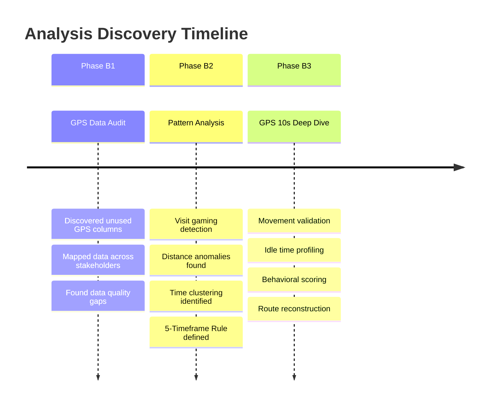
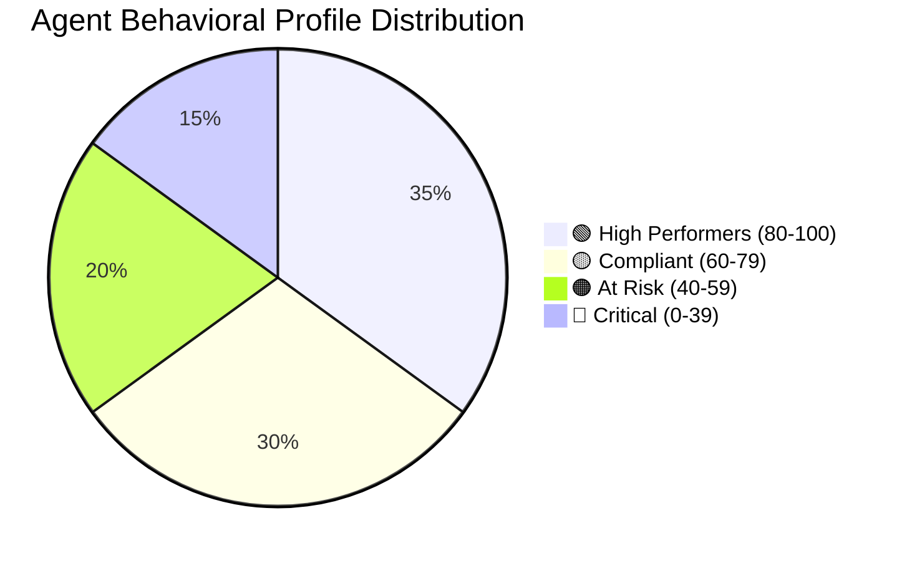
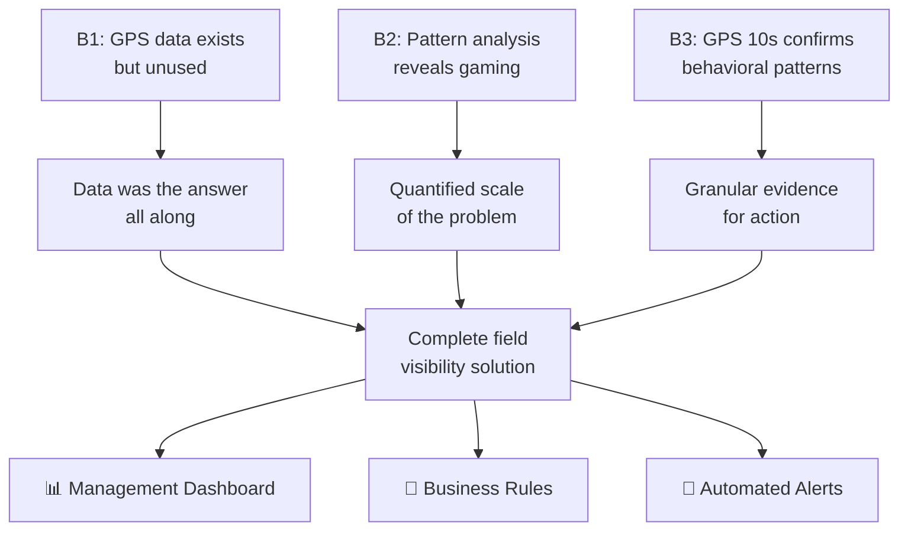

# 📊 Analysis Findings — GPS Field Performance

> *This document presents the key findings, patterns, and recommendations from the GPS Field Performance analysis. It covers discoveries from all three phases (B1, B2, B3) and their business implications.*

---

## Table of Contents

- [Analysis Overview](#analysis-overview)
- [Phase B1 — Data Audit Findings](#phase-b1--data-audit-findings)
- [Phase B2 — Pattern Analysis Findings](#phase-b2--pattern-analysis-findings)
  - [Visit Gaming Pattern](#visit-gaming-pattern)
  - [Distance Anomalies](#distance-anomalies)
  - [Time Distribution Analysis](#time-distribution-analysis)
- [Phase B3 — GPS 10s Deep Dive Findings](#phase-b3--gps-10s-deep-dive-findings)
  - [Movement Validation](#movement-validation)
  - [Idle Time Analysis](#idle-time-analysis)
  - [Behavioral Profiling](#behavioral-profiling)
- [Cross-Phase Insights](#cross-phase-insights)
- [Business Recommendations](#business-recommendations)
- [Limitations & Caveats](#limitations--caveats)

---

## Analysis Overview



---

## Phase B1 — Data Audit Findings

### Finding 1: GPS Data Was Collected But Never Analyzed

| Aspect | Detail |
|---|---|
| **Discovery** | Two GPS columns (`visit_gps_lat`, `visit_gps_lon`) in `collection_visit` had never been queried for analytics |
| **Root Cause** | No cross-team communication about available data fields |
| **Impact** | Months/years of GPS data sitting unused while management had no field visibility |
| **Action** | Became the foundation for the entire project |

### Finding 2: FPA System Had Richer Data

| Aspect | Detail |
|---|---|
| **Discovery** | The FPA system recorded complete daily GPS summaries per agent — a dataset the business side didn't know existed |
| **Root Cause** | Technical team maintained this data for system monitoring, not analytics |
| **Impact** | Unlocked daily trajectory analysis and distance calculations |
| **Action** | Integrated FPA data into the analytics pipeline |

### Finding 3: Data Quality Gaps

<!-- 🔧 UPDATE: Replace with your actual data quality statistics -->

| Issue | Affected Table | Prevalence | Impact |
|---|---|---|---|
| Null GPS coordinates | `collection_visit` | ~*[X]%* of records | Cannot verify these visits |
| Inconsistent timezones | Multiple | Sporadic | Fixed in staging layer |
| Duplicate records | `gps_10s_pings` | ~*[X]%* | Deduplicated in staging |
| Missing agent profiles | `field_agent_profile` | *[X]* agents | Could not classify by team/region |

---

## Phase B2 — Pattern Analysis Findings

### Visit Gaming Pattern

> **🚨 Critical Finding**: Agents were systematically gaming the visit tracking system by logging multiple visits within seconds of each other.

#### Evidence

```
Example — Agent X, Date: 2023-10-15
─────────────────────────────────────────────
Time         Customer    Duration    Gap
─────────────────────────────────────────────
09:01:03     Cust_A      5 sec      —
09:01:15     Cust_B      4 sec      12 sec
09:01:28     Cust_C      3 sec      13 sec
09:01:41     Cust_D      6 sec      13 sec
09:01:55     Cust_E      4 sec      14 sec
09:02:08     Cust_F      5 sec      13 sec
... (12 more visits) ...
09:04:02     Cust_R      4 sec      —
─────────────────────────────────────────────
TOTAL: 18 visits in 3 minutes
No further activity until end of day
```

#### Statistical Summary

<!-- 🔧 UPDATE: Replace with your actual statistics -->

| Metric | Legitimate Visits | Gaming Visits |
|---|---|---|
| **Avg. visit duration** | *[X]* minutes | < 10 seconds |
| **Avg. inter-visit gap** | *[X]* minutes | < 30 seconds |
| **Visits per hour** | *[X]* | 50+ |
| **% of total visits** | *[X]%* | *[X]%* |
| **Agents affected** | — | *[X]* agents (*[X]%* of workforce) |

#### Visualization Concept

```
Legitimate agent visit distribution (visits per hour):

Hour:  08  09  10  11  12  13  14  15  16  17
       ██  ██  ██  ██  ░░  ██  ██  ██  ██  ██
       ██  ██  ██  ██      ██  ██  ██  ██  ██
       ██  ██  ██  ██      ██  ██  ██  ██
           ██  ██                  ██

Gaming agent visit distribution:

Hour:  08  09  10  11  12  13  14  15  16  17
       ██
       ██
       ██
       ██
       ██
       ██
       ██
       ██
       ██
       (all 30+ visits in first 5 minutes)
```

---

### Distance Anomalies

> **Finding**: Some agents logged visits at locations that were geographically impossible given the time between visits.

#### Impossible Travel Detection

| Scenario | Example | Implied Speed | Verdict |
|---|---|---|---|
| Agent logs Visit A, then Visit B 2 minutes later | Distance: 50 km | 1,500 km/h | ❌ Physically impossible |
| Agent logs Visit A, then Visit B 30 minutes later | Distance: 5 km | 10 km/h | ✅ Reasonable (motorbike/car) |
| Agent logs Visit A, then Visit B 1 minute later | Distance: 0.01 km | 0.6 km/h | 🟡 Suspicious (same location, different customer?) |

<!-- 🔧 UPDATE: Replace with your actual findings -->

#### Distance Distribution

```
Inter-visit distance distribution:

Distance (km)    Frequency
0 - 0.1         ████████████████████ (XX%) ← Suspicious cluster
0.1 - 1.0       ████████████ (XX%)
1.0 - 5.0       ████████████████ (XX%)     ← Expected range
5.0 - 10.0      ████████ (XX%)             ← Expected range
10.0 - 50.0     ████ (XX%)
50.0+            █ (XX%)                    ← Impossible travel
```

---

### Time Distribution Analysis

> **Finding**: Visits should be distributed throughout the working day. Analysis revealed significant clustering.

#### Healthy vs. Unhealthy Patterns

| Pattern | Description | % of Agents | Classification |
|---|---|---|---|
| **Distributed** | Visits spread across 4-5 timeframes | *[X]%* | ✅ Healthy |
| **Morning-heavy** | 70%+ of visits before noon | *[X]%* | 🟡 Review |
| **Single-burst** | All visits within 1 hour | *[X]%* | 🔴 Gaming |
| **End-of-day dump** | All visits logged after 16:00 | *[X]%* | 🔴 Gaming |

<!-- 🔧 UPDATE: Replace with your actual findings -->

This analysis directly led to the creation of the **5-Timeframe Rule** (see [Metrics Definitions](metrics_definitions.md#the-5-timeframe-rule)).

---

## Phase B3 — GPS 10s Deep Dive Findings

### Movement Validation

> **Goal**: Verify whether agents physically moved to the locations they reported visiting.

#### Methodology

1. For each logged visit, find the nearest GPS 10s ping (within ±30 second window)
2. Calculate the distance between the visit's reported GPS and the actual GPS ping location
3. Classify the discrepancy

#### Results

| Discrepancy | Range | Classification | Frequency |
|---|---|---|---|
| **Exact match** | < 50m | ✅ Visit confirmed | *[X]%* |
| **Minor drift** | 50m – 200m | 🟡 GPS noise, likely OK | *[X]%* |
| **Significant gap** | 200m – 1km | 🟠 Suspicious | *[X]%* |
| **No GPS movement** | > 1km or no ping found | 🔴 Visit not confirmed | *[X]%* |

<!-- 🔧 UPDATE: Replace with your actual findings -->

### Idle Time Analysis

> **Goal**: Identify how much of the working day agents were actually moving vs. stationary.

#### Key Findings

| Metric | Top Performers | Average | Bottom Performers |
|---|---|---|---|
| **Active hours** (with GPS movement) | *[X]* hours | *[X]* hours | *[X]* hours |
| **Idle time** (GPS stationary > 30 min) | *[X]* hours | *[X]* hours | *[X]* hours |
| **Unique locations visited** | *[X]* | *[X]* | *[X]* |
| **Total distance** | *[X]* km | *[X]* km | *[X]* km |

<!-- 🔧 UPDATE: Replace with your actual findings -->

### Behavioral Profiling

Using the composite Legitimacy Score (see [Metrics Definitions](metrics_definitions.md#legitimacy-score)), agents were classified into behavioral profiles:



<!-- 🔧 UPDATE: Replace percentages with your actual distribution -->

| Profile | Characteristics | Recommended Action |
|---|---|---|
| **🟢 High Performers** | Distributed visits, high verification rate, strong GPS coverage | Recognize and reward; use as benchmarks |
| **🟡 Compliant** | Meets minimum requirements but room for improvement | Monitor trends; provide coaching |
| **🟠 At Risk** | Partial compliance; some flagged visits | Supervisor review; increase QC sampling |
| **🔴 Critical** | Visit gaming detected; low GPS verification | Immediate investigation; potential disciplinary action |

---

## Cross-Phase Insights

### Connecting the Dots



### Key Takeaways Across Phases

| Insight | Phase | Significance |
|---|---|---|
| **Data exists but isn't used** — the most common "hidden feature" in organizations | B1 | Before building new systems, audit what's already available |
| **Patterns emerge when you connect datasets** — individual tables tell partial stories | B2 | Cross-source analysis is where the real value lies |
| **Granular data validates (or invalidates) aggregate findings** — 10s GPS data confirmed what visit-level data suggested | B3 | Always validate findings at a more granular level when possible |
| **Business rules should be data-driven** — the 5-Timeframe Rule came from the data, not from assumptions | B2→B3 | Analytics engineers translate data patterns into business logic |

---

## Business Recommendations

### Immediate Actions

| # | Recommendation | Priority | Expected Impact |
|---|---|---|---|
| 1 | **Deploy 5-Timeframe Rule** as mandatory compliance check | 🔴 High | Eliminate single-burst gaming pattern |
| 2 | **Implement automated flagging** for visits < minimum duration | 🔴 High | Real-time detection of fraudulent visits |
| 3 | **Create agent-facing dashboard** showing their own GPS metrics | 🟡 Medium | Self-correction through transparency |
| 4 | **Weekly compliance reports** to supervisors | 🟡 Medium | Management accountability |

### Strategic Recommendations

| # | Recommendation | Timeline | Expected Impact |
|---|---|---|---|
| 1 | **Integrate GPS verification into visit app** — require GPS check-in for valid visit | Medium-term | Prevent gaming at the source |
| 2 | **Route optimization** — suggest efficient routes based on customer locations | Medium-term | Improve agent productivity |
| 3 | **Predictive modeling** — identify agents likely to game before they start | Long-term | Proactive management |
| 4 | **Customer-side verification** — SMS/call confirmation of agent visit | Long-term | Independent validation source |

---

## Limitations & Caveats

> [!WARNING]
> These findings should be interpreted with the following limitations in mind.

| Limitation | Impact | Mitigation |
|---|---|---|
| **GPS accuracy** varies by device and environment | Indoor visits may show poor GPS quality | Use accuracy threshold (50m) and don't penalize agents for indoor visits |
| **Missing GPS data** for some visits | Cannot verify all visits | Track GPS coverage rate; investigate consistently low coverage |
| **Historical data quality** may differ from current | Early 2023 data may have more quality issues | Focus analysis on recent data; use older data for trend detection only |
| **Correlation ≠ causation** | Short visits may be legitimate (e.g., customer not home, quick document pickup) | Use composite scoring, not single-metric judgments |
| **Sample bias** | Analysis based on available data; agents who disable GPS are not represented | Monitor GPS coverage rate as a separate compliance metric |

---

<p align="center"><a href="#/">← Back to Home Page</a></p>
