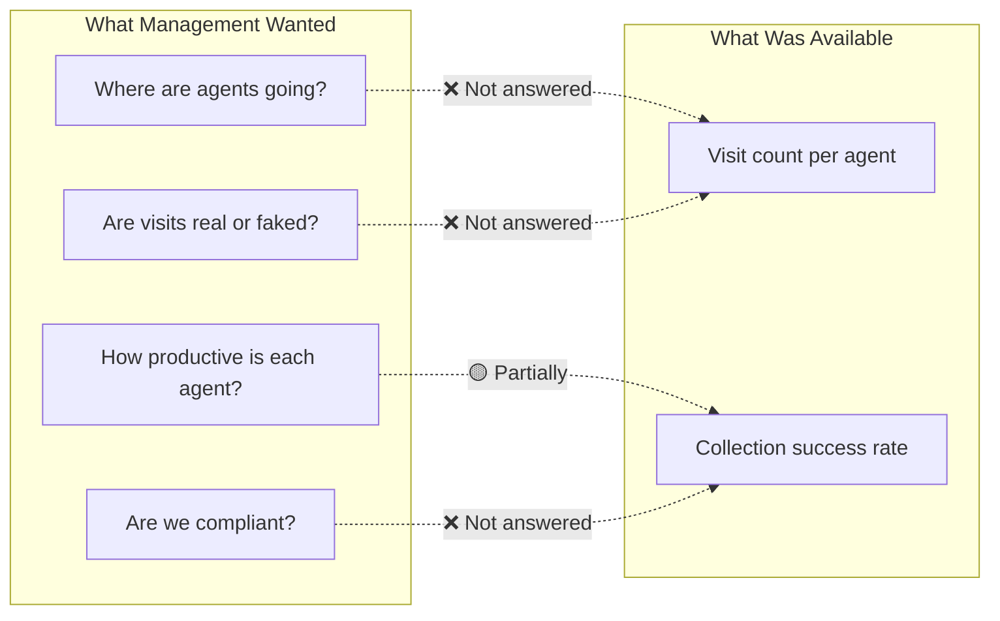
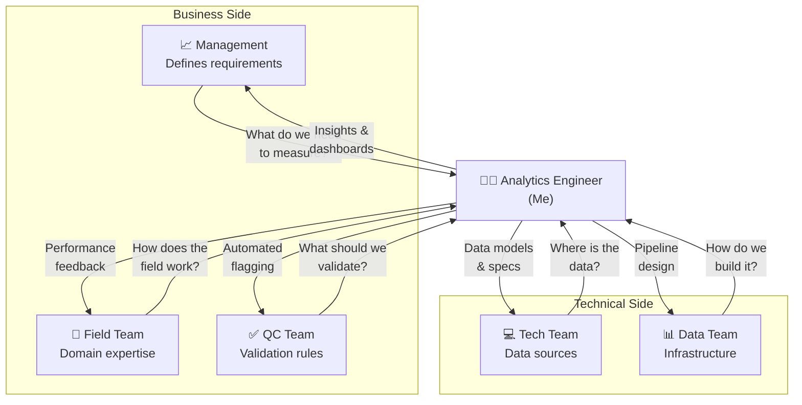

# 🏢 Business Context — GPS Field Performance

> *This document provides the full narrative of the business problem, stakeholder discovery journey, and the decisions that shaped this project.*

---

## Table of Contents

- [Industry Background](#industry-background)
- [The Crisis (As-Is Situation)](#the-crisis-as-is-situation)
- [The Visibility Gap](#the-visibility-gap)
- [Stakeholder Discovery Journey](#stakeholder-discovery-journey)
  - [B1 — GPS Data Audit](#b1--gps-data-audit)
  - [B2 — Pattern Analysis](#b2--pattern-analysis)
  - [B3 — GPS 10s Deep Dive](#b3--gps-10s-deep-dive)
- [From Data to Business Rules](#from-data-to-business-rules)
- [Stakeholder Map & Collaboration](#stakeholder-map--collaboration)

---

## Industry Background

<!-- 🔧 UPDATE: Add context about your specific industry (e.g., consumer lending, debt collection, microfinance) -->

In the consumer lending / debt collection industry, **Field teams** (also known as Field Performance Agents or FPAs) are deployed to visit customers in person — typically for collections, document verification, or customer engagement. These agents operate in the field with mobile devices that record their activities, including GPS coordinates.

Monitoring field operations is critical because:
- **Regulatory compliance** requires proof of legitimate customer interactions
- **Operational efficiency** depends on optimizing agent routes and coverage
- **Fraud prevention** is necessary to detect agents gaming the visit system

---

## The Crisis (As-Is Situation)

### Early 2023 — Regulatory Shock

In early 2023, changes in lending regulations triggered a significant shift:

| Event | Impact |
|---|---|
| **Legal/regulatory changes** | New rules governing how field collection agents could interact with customers |
| **Customer lawsuits** | Customers began filing lawsuits alleging improper or non-existent field visits |
| **Field team chaos** | Without clear monitoring, field teams operated with minimal oversight |

### Late 2023 — Management Demands Visibility

By late 2023, management at all levels needed answers to a fundamental question:

> ***"What are our Field teams actually doing every day?"***

### Existing Tools — Insufficient

At this point, the available tooling was minimal:

| Tool | What It Provided | What It Lacked |
|---|---|---|
| **Field Performance Dashboard** | Basic KPIs: visit count, collection rates | No location verification, no behavioral analysis |
| **`collection_visit` Table** | Visit logs: who visited whom, when | GPS data existed but was **never queried or analyzed** |

The critical discovery: **GPS latitude and longitude columns existed in the dataset but had never been used by any team.**

---

## The Visibility Gap



The gap between **what management needed** and **what was available** was enormous. Bridging this gap became the core mission of this project.

---

## Stakeholder Discovery Journey

### B1 — GPS Data Audit

> **Goal**: Understand the GPS data landscape — who uses it, how, and where it lives.

I conducted structured interviews and data audits with each stakeholder group:

#### Field Team
- **How they used GPS**: Primarily for navigation (Google Maps). They were not aware their GPS was being logged.
- **Their pain point**: Felt they were being asked to do more visits without clear performance criteria.
- **Key insight**: Field agents had no feedback loop — they couldn't see their own GPS data or performance metrics.

#### QC (Quality Control) Team
- **How they used GPS**: Only checked **2 columns** from the `collection_visit` table as part of spot-check audits.
- **Their pain point**: Manual, slow QC process. Could only review a small sample of visits.
- **Key insight**: QC had no automated tools to flag suspicious visits at scale.

#### Technical Team
- **How they used GPS**: Confirmed that the system collected **full GPS records in FPA** — one record per agent per day, with continuous GPS tracking.
- **Their pain point**: No one from the business side had ever asked for this data.
- **Key insight**: **The data was there all along.** GPS records with complete daily trajectories existed in FPA but were never surfaced to analytics or business users.

#### Data Team
- **How they used GPS**: Had never mapped GPS columns to any business definitions.
- **Their pain point**: Unclear data lineage — GPS data flowed from devices to database but no one documented the meaning.
- **Key insight**: Need for a proper data dictionary and data catalog.

### B2 — Pattern Analysis

> **Goal**: Use GPS + FPA data to detect behavioral patterns.

After mapping the data landscape, I joined GPS data from FPA with `collection_visit` and other Field domain tables. The analysis revealed:

#### Visit Distance Analysis
- Measured the geographic distance between consecutive visits for each agent
- **Finding**: Some agents logged visits at locations **hundreds of kilometers apart within minutes** — physically impossible

#### Visit Duration Analysis
- Calculated the time spent at each visit location using GPS entry/exit timestamps
- **Finding**: Many "visits" lasted **less than 10 seconds** — far too short for any legitimate customer interaction

#### Visit Spacing Pattern
- Analyzed the temporal distribution of visits throughout the day
- **Finding**: Agents were **clustering visits** — logging 10-20 visits within a few minutes, then going idle
- **Implication**: This pattern strongly suggested visit gaming / fabricated check-ins

```
Example Pattern Detected:
Agent X on 2023-10-15:
  09:01:03 - Visit Customer A
  09:01:15 - Visit Customer B  (12 seconds later)
  09:01:28 - Visit Customer C  (13 seconds later)
  09:01:41 - Visit Customer D  (13 seconds later)
  ... (15 more visits in 3 minutes)
  09:04:02 - Last visit logged
  [No more activity until 17:00]
```

### B3 — GPS 10s Deep Dive

> **Goal**: Validate patterns using granular GPS trajectory data.

To confirm the findings from B2, I analyzed the **GPS 10-second interval data** — GPS pings recorded every 10 seconds from agents' mobile devices:

| Analysis | Method | Finding |
|---|---|---|
| **Movement validation** | Compared GPS trajectory with logged visit locations | Some visits logged at locations the agent never physically visited |
| **Idle time detection** | Identified periods of GPS stationarity | Long idle periods correlated with low-quality visit clusters |
| **Route reconstruction** | Plotted daily GPS trajectories per agent | Revealed actual vs. reported field coverage |
| **Behavioral profiling** | Scored agents on visit legitimacy indicators | Created a framework for ongoing monitoring |

---

## From Data to Business Rules

The analysis findings were translated into concrete, actionable business rules:

### The 5-Timeframe Rule

| Timeframe | Window | Requirement |
|---|---|---|
| **TF1** | 08:00 – 10:00 | At least 1 verified visit |
| **TF2** | 10:00 – 12:00 | At least 1 verified visit |
| **TF3** | 12:00 – 14:00 | At least 1 verified visit |
| **TF4** | 14:00 – 16:00 | At least 1 verified visit |
| **TF5** | 16:00 – 18:00 | At least 1 verified visit |

> **Rationale**: Legitimate field work requires agents to be active throughout the working day, visiting different customers across different areas. Clustering all visits in a single window is a strong indicator of gaming.

<!-- 🔧 UPDATE: Adjust timeframes and requirements to match your actual business rules -->

### Additional Rules Derived

| Rule | Threshold | Purpose |
|---|---|---|
| **Minimum visit duration** | ≥ *[X]* minutes per visit | Ensures agent spent meaningful time at location |
| **Minimum inter-visit distance** | ≥ *[X]* meters between consecutive visits | Prevents fake multi-check-ins at same location |
| **Maximum visit velocity** | ≤ *[X]* km/h implied travel speed | Flags physically impossible travel between visits |
| **GPS accuracy threshold** | Accuracy radius ≤ *[X]* meters | Ensures GPS data quality meets analysis standards |

---

## Stakeholder Map & Collaboration

### Communication Flow



### Key Collaboration Moments

| Moment | Who | Outcome |
|---|---|---|
| **GPS column discovery** | Tech Team + Data Team | Unlocked the entire project by surfacing unused data |
| **Visit gaming pattern** | QC Team + Management | Validated that the pattern was real, not a data error |
| **5-Timeframe Rule** | Management + Field Team | Created an enforceable, fair rule based on data evidence |
| **Dashboard design** | Management + Field Team | Designed outputs that both oversight and field teams found useful |

---

<p align="center"><a href="../README.md">← Back to README</a></p>
