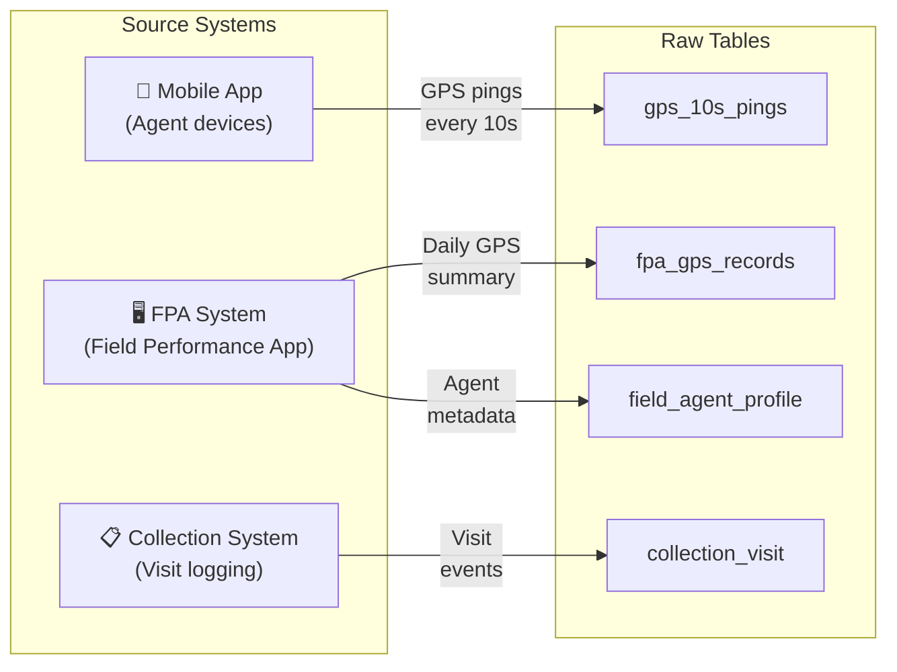
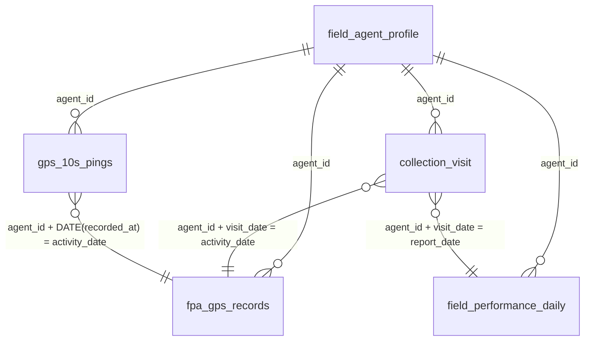

# 📗 Data Dictionary — GPS Field Performance

> *This document defines all data sources, tables, and columns used in the GPS Field Performance project. It serves as the single source of truth for data semantics.*

---

## Table of Contents

- [Data Source Overview](#data-source-overview)
- [Table Definitions](#table-definitions)
  - [collection_visit](#collection_visit)
  - [fpa_gps_records](#fpa_gps_records)
  - [gps_10s_pings](#gps_10s_pings)
  - [field_agent_profile](#field_agent_profile)
  - [field_performance_daily](#field_performance_daily)
- [Relationships & Joins](#relationships--joins)
- [Data Quality Notes](#data-quality-notes)

---

## Data Source Overview

| Source | Table | Grain | Volume (est.) | Refresh |
|---|---|---|---|---|
| Mobile App | `gps_10s_pings` | 1 row per 10-second GPS ping per agent | Very high | Real-time / near real-time |
| FPA System | `fpa_gps_records` | 1 row per agent per day | Medium | Daily |
| Collection System | `collection_visit` | 1 row per visit event | High | Real-time |
| FPA System | `field_agent_profile` | 1 row per agent | Low | As-needed |
| Derived | `field_performance_daily` | 1 row per agent per day | Medium | Daily (computed) |

---

## Table Definitions

### `collection_visit`

> **Description**: Records each field visit event logged by an agent. This is the primary visit tracking table used by Field and QC teams.

| Column | Data Type | Nullable | Description | Business Meaning |
|---|---|---|---|---|
| `visit_id` | STRING | No | Unique identifier for each visit | Primary key |
| `agent_id` | STRING | No | Identifier of the field agent | Links to `field_agent_profile` |
| `customer_id` | STRING | No | Identifier of the customer visited | The target of the visit |
| `visit_timestamp` | TIMESTAMP | No | When the visit was logged | Used for time-series analysis |
| `visit_date` | DATE | No | Date of the visit (derived) | Partition key |
| `visit_result` | STRING | Yes | Outcome of the visit | e.g., "collected", "not_home", "refused" |
| `visit_gps_lat` | FLOAT | Yes | GPS latitude at check-in | **Previously unused** — key column for this project |
| `visit_gps_lon` | FLOAT | Yes | GPS longitude at check-in | **Previously unused** — key column for this project |
| `visit_duration_sec` | INTEGER | Yes | Duration of visit in seconds | May be self-reported; cross-check with GPS |
| `notes` | STRING | Yes | Agent's notes about the visit | Free-text field |

<!-- 🔧 UPDATE: Replace with your actual column names and types -->

**Key Notes**:
- `visit_gps_lat` and `visit_gps_lon` were the **two columns** that Field and QC used, but only for basic spot-checks
- GPS coordinates may be null if the agent's device had GPS disabled or poor signal

---

### `fpa_gps_records`

> **Description**: Daily GPS summary records from the Field Performance Application. Contains aggregated GPS data per agent per day. This table was **discovered during the B1 audit phase** — the Technical team confirmed it existed but had never been used for analytics.

| Column | Data Type | Nullable | Description | Business Meaning |
|---|---|---|---|---|
| `record_id` | STRING | No | Unique record identifier | Primary key |
| `agent_id` | STRING | No | Field agent identifier | Links to `field_agent_profile` |
| `activity_date` | DATE | No | Date of activity | One record per agent per day |
| `first_gps_lat` | FLOAT | Yes | First GPS coordinate of the day | Start of daily activity |
| `first_gps_lon` | FLOAT | Yes | First GPS longitude of the day | Start of daily activity |
| `last_gps_lat` | FLOAT | Yes | Last GPS coordinate of the day | End of daily activity |
| `last_gps_lon` | FLOAT | Yes | Last GPS longitude of the day | End of daily activity |
| `total_distance_km` | FLOAT | Yes | Total distance traveled (km) | Derived from GPS trajectory |
| `active_hours` | FLOAT | Yes | Hours with GPS movement detected | Indicates actual working time |
| `gps_point_count` | INTEGER | Yes | Number of GPS pings recorded | Data completeness indicator |

<!-- 🔧 UPDATE: Replace with your actual column names and types -->

**Key Notes**:
- This table was the **key unlock** of the project — it contained daily GPS summaries that nobody was using
- Cross-referencing with `collection_visit` revealed discrepancies between reported visits and actual GPS activity

---

### `gps_10s_pings`

> **Description**: Raw GPS ping data recorded every 10 seconds from field agents' mobile devices. This is the most granular GPS data available and was explored in **Phase B3** of the project.

| Column | Data Type | Nullable | Description | Business Meaning |
|---|---|---|---|---|
| `ping_id` | STRING | No | Unique ping identifier | Primary key |
| `agent_id` | STRING | No | Field agent identifier | Links to `field_agent_profile` |
| `recorded_at` | TIMESTAMP | No | Exact time of GPS recording | 10-second intervals |
| `latitude` | FLOAT | No | GPS latitude | Agent's position |
| `longitude` | FLOAT | No | GPS longitude | Agent's position |
| `accuracy_meters` | FLOAT | Yes | GPS accuracy radius in meters | Quality indicator; filter out > threshold |
| `speed_kmh` | FLOAT | Yes | Instantaneous speed | Movement detection |
| `battery_level` | FLOAT | Yes | Device battery percentage | Data quality context |
| `is_mock_location` | BOOLEAN | Yes | Whether GPS was spoofed | Fraud detection flag |

<!-- 🔧 UPDATE: Replace with your actual column names and types -->

**Key Notes**:
- **Volume**: This table is very large (potentially millions of rows per day across all agents)
- **Quality**: Accuracy varies; pings with `accuracy_meters > 50` may be unreliable
- **Privacy**: Contains sensitive location data — handle per data governance policies

---

### `field_agent_profile`

> **Description**: Master data for field agents, including their assigned region, team, and status.

| Column | Data Type | Nullable | Description | Business Meaning |
|---|---|---|---|---|
| `agent_id` | STRING | No | Unique agent identifier | Primary key |
| `agent_name` | STRING | No | Agent's full name | Display purposes |
| `team_id` | STRING | Yes | Team assignment | Grouping for team-level analysis |
| `region` | STRING | Yes | Geographic region | Regional performance comparison |
| `supervisor_id` | STRING | Yes | Direct supervisor | Management hierarchy |
| `hire_date` | DATE | Yes | When the agent joined | Tenure analysis |
| `status` | STRING | No | Active / Inactive / Suspended | Filter for active analysis |

<!-- 🔧 UPDATE: Replace with your actual column names and types -->

---

### `field_performance_daily`

> **Description**: **Derived / computed table** — Daily aggregated performance metrics per agent. This is the final analytics-ready table produced by this project.

| Column | Data Type | Nullable | Description | Business Meaning |
|---|---|---|---|---|
| `agent_id` | STRING | No | Field agent identifier | Dimension key |
| `report_date` | DATE | No | Date of performance record | Time dimension |
| `total_visits` | INTEGER | No | Total visits logged | Raw visit count |
| `verified_visits` | INTEGER | No | GPS-verified visits | Visits that passed all validation rules |
| `flagged_visits` | INTEGER | No | Visits flagged as suspicious | Visits violating business rules |
| `timeframes_covered` | INTEGER | No | Number of 5 timeframes with verified visits (0-5) | 5-Timeframe Rule compliance |
| `total_distance_km` | FLOAT | Yes | Total GPS distance traveled | Effort indicator |
| `avg_visit_duration_min` | FLOAT | Yes | Average visit duration | Quality indicator |
| `avg_inter_visit_dist_km` | FLOAT | Yes | Average distance between visits | Route efficiency |
| `collection_success_rate` | FLOAT | Yes | % of visits resulting in collection | Outcome metric |
| `legitimacy_score` | FLOAT | Yes | Composite score (0-100) | Overall visit quality score |
| `is_compliant` | BOOLEAN | No | Meets all business rules | Pass/fail flag |

<!-- 🔧 UPDATE: Replace with your actual column names and types -->

---

## Relationships & Joins

### Common Join Patterns

| Join | Keys | Purpose |
|---|---|---|
| `collection_visit` ↔ `fpa_gps_records` | `agent_id` + `visit_date = activity_date` | Validate visits against daily GPS summary |
| `collection_visit` ↔ `gps_10s_pings` | `agent_id` + time window around `visit_timestamp` | Match visits to exact GPS location at visit time |
| `gps_10s_pings` ↔ `fpa_gps_records` | `agent_id` + `DATE(recorded_at) = activity_date` | Reconcile granular pings with daily summary |
| Any table ↔ `field_agent_profile` | `agent_id` | Enrich with agent metadata (team, region) |

---

## Data Quality Notes

### Known Issues

| Issue | Table | Impact | Mitigation |
|---|---|---|---|
| **Null GPS coordinates** | `collection_visit` | ~*[X]%* of visits lack GPS | Flagged as "unverified"; not counted in GPS metrics |
| **GPS accuracy drift** | `gps_10s_pings` | Indoor/underground pings show large accuracy radius | Filter: `accuracy_meters <= 50` |
| **Duplicate pings** | `gps_10s_pings` | Occasional duplicate timestamps | Deduplicate by `agent_id + recorded_at` |
| **Missing FPA records** | `fpa_gps_records` | Some agents have gaps in daily records | Cross-reference with `gps_10s_pings` for coverage |
| **Time zone inconsistency** | Multiple tables | Timestamps may be in UTC or local time | Standardize to local timezone in staging layer |

<!-- 🔧 UPDATE: Replace with your actual data quality findings -->

### Data Freshness & Latency

| Table | Expected Latency | SLA |
|---|---|---|
| `gps_10s_pings` | Near real-time (seconds) | Best-effort |
| `collection_visit` | Near real-time (seconds) | Best-effort |
| `fpa_gps_records` | Daily batch (overnight) | Next morning by 06:00 |
| `field_performance_daily` | Daily computed (after FPA) | Next morning by 08:00 |

---

<a href="../README.md">← Back to README</a>

