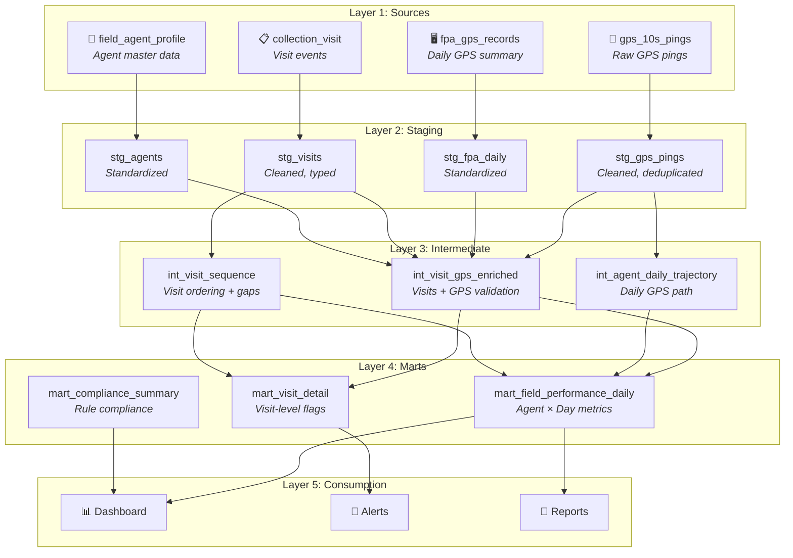
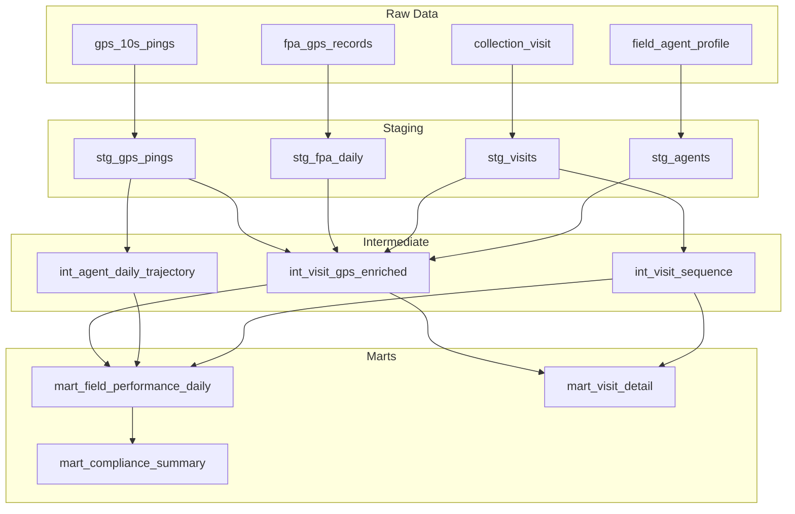

# 🏗️ Technical Architecture — GPS Field Performance

> *This document details the technical design of the GPS Field Performance analytics pipeline, including data flow, processing phases, and infrastructure decisions.*

---

## Table of Contents

- [Architecture Overview](#architecture-overview)
- [Data Pipeline Design](#data-pipeline-design)
  - [Layer 1: Sources](#layer-1-sources)
  - [Layer 2: Staging](#layer-2-staging)
  - [Layer 3: Intermediate](#layer-3-intermediate)
  - [Layer 4: Marts](#layer-4-marts)
- [Processing Phases](#processing-phases)
- [Data Flow Diagram](#data-flow-diagram)
- [Key Technical Decisions](#key-technical-decisions)
- [Performance Considerations](#performance-considerations)

---

## Architecture Overview

The project follows a **layered transformation architecture** commonly used in modern analytics engineering (inspired by the dbt modeling pattern):

```
Sources → Staging → Intermediate → Marts → Consumption
```



---

## Data Pipeline Design

### Layer 1: Sources

> **Purpose**: Raw data as-is from source systems. No transformations.

| Source Table | System | Grain | Notes |
|---|---|---|---|
| `gps_10s_pings` | Mobile App | Ping (10s) | Very high volume; partition by date |
| `fpa_gps_records` | FPA System | Agent × Day | Daily batch load |
| `collection_visit` | Collection System | Visit event | Near real-time |
| `field_agent_profile` | FPA System | Agent | Slowly changing dimension |

### Layer 2: Staging

> **Purpose**: Clean, rename, cast, and deduplicate raw data. One staging model per source table.

| Model | Source | Key Transformations |
|---|---|---|
| `stg_gps_pings` | `gps_10s_pings` | Deduplicate by `agent_id + recorded_at`; filter `accuracy_meters <= 50`; standardize timezone to local |
| `stg_fpa_daily` | `fpa_gps_records` | Rename columns to standard naming; cast types; filter out test agents |
| `stg_visits` | `collection_visit` | Clean visit results to enum; cast GPS to float; derive `visit_date` from timestamp |
| `stg_agents` | `field_agent_profile` | Filter active agents; standardize region names |

### Layer 3: Intermediate

> **Purpose**: Business logic and cross-source joins. This is where the core analytics engineering happens.

#### `int_visit_gps_enriched`

Enriches each visit with GPS validation data:

```sql
-- Pseudocode
SELECT
    v.*,
    -- Find nearest GPS ping to visit timestamp
    g.latitude AS gps_lat_at_visit,
    g.longitude AS gps_lon_at_visit,
    g.accuracy_meters,
    -- Calculate distance between visit GPS and nearest ping GPS
    haversine(v.visit_gps_lat, v.visit_gps_lon,
              g.latitude, g.longitude) AS gps_discrepancy_km,
    -- Legitimacy flags
    CASE WHEN v.visit_gps_lat IS NULL THEN TRUE ELSE FALSE END AS is_missing_gps,
    CASE WHEN visit_duration_sec < threshold THEN TRUE ELSE FALSE END AS is_too_short,
    -- ... more flags
FROM stg_visits v
LEFT JOIN stg_gps_pings g
    ON v.agent_id = g.agent_id
    AND g.recorded_at BETWEEN v.visit_timestamp - INTERVAL '30 seconds'
                        AND v.visit_timestamp + INTERVAL '30 seconds'
LEFT JOIN stg_agents a ON v.agent_id = a.agent_id
```

#### `int_agent_daily_trajectory`

Reconstructs the daily GPS path for each agent:

```sql
-- Pseudocode
SELECT
    agent_id,
    DATE(recorded_at) AS activity_date,
    COUNT(*) AS total_pings,
    MIN(recorded_at) AS first_ping,
    MAX(recorded_at) AS last_ping,
    SUM(distance_to_next_ping_km) AS total_distance_km,
    COUNT(DISTINCT EXTRACT(HOUR FROM recorded_at)) AS active_hours,
    -- Idle detection: consecutive pings within 10m radius
    COUNT(*) FILTER (WHERE speed_kmh < 1) AS idle_pings
FROM (
    SELECT *,
        haversine(latitude, longitude,
                  LEAD(latitude) OVER w, LEAD(longitude) OVER w) AS distance_to_next_ping_km,
        -- ... speed calculation
    FROM stg_gps_pings
    WINDOW w AS (PARTITION BY agent_id ORDER BY recorded_at)
) sub
GROUP BY agent_id, DATE(recorded_at)
```

#### `int_visit_sequence`

Orders visits chronologically and calculates inter-visit metrics:

```sql
-- Pseudocode
SELECT
    visit_id,
    agent_id,
    visit_timestamp,
    LAG(visit_timestamp) OVER w AS prev_visit_time,
    EXTRACT(EPOCH FROM visit_timestamp - LAG(visit_timestamp) OVER w) AS seconds_since_prev,
    haversine(visit_gps_lat, visit_gps_lon,
              LAG(visit_gps_lat) OVER w, LAG(visit_gps_lon) OVER w) AS km_from_prev,
    -- Implied travel speed
    (km_from_prev / NULLIF(seconds_since_prev / 3600.0, 0)) AS implied_speed_kmh,
    -- Timeframe assignment
    CASE
        WHEN EXTRACT(HOUR FROM visit_timestamp) BETWEEN 8 AND 9 THEN 'TF1'
        -- ... etc
    END AS timeframe
FROM stg_visits
WHERE visit_gps_lat IS NOT NULL
WINDOW w AS (PARTITION BY agent_id, visit_date ORDER BY visit_timestamp)
```

### Layer 4: Marts

> **Purpose**: Final, consumption-ready tables optimized for dashboard queries and reporting.

#### `mart_field_performance_daily`

The primary analytics table — one row per agent per day with all metrics:

| Column Group | Columns | Source |
|---|---|---|
| **Dimensions** | `agent_id`, `report_date`, `region`, `team` | `stg_agents` |
| **Visit Counts** | `total_visits`, `verified_visits`, `flagged_visits` | `int_visit_gps_enriched` |
| **GPS Metrics** | `total_distance_km`, `gps_coverage_rate`, `avg_accuracy_m` | `int_agent_daily_trajectory` |
| **Time Metrics** | `avg_visit_duration_min`, `avg_inter_visit_dist_km` | `int_visit_sequence` |
| **Compliance** | `timeframes_covered`, `is_compliant` | `int_visit_sequence` |
| **Performance** | `collection_success_rate`, `legitimacy_score` | Derived |

#### `mart_visit_detail`

Visit-level detail with all flags — used for drill-down and alert generation:

| Purpose | Key Columns |
|---|---|
| Investigation | `visit_id`, `agent_id`, `customer_id`, `visit_timestamp` |
| GPS validation | `gps_discrepancy_km`, `accuracy_meters`, `is_missing_gps` |
| Legitimacy | `legitimacy_status`, `flag_reason`, `seconds_since_prev`, `implied_speed_kmh` |

#### `mart_compliance_summary`

Aggregated compliance view for management dashboards:

| Grain Options | Use Case |
|---|---|
| Agent × Week | Weekly performance review |
| Team × Day | Team-level monitoring |
| Region × Month | Regional benchmarking |

---

## Processing Phases

The technical delivery was organized into phases aligned with the business discovery journey:

```mermaid
flowchart LR
    subgraph Phase1 ["Phase 1: Foundation"]
        P1A["Data audit &<br/>profiling"]
        P1B["Staging models<br/>build"]
        P1C["Data dictionary<br/>documentation"]
    end

    subgraph Phase2 ["Phase 2: Core Logic"]
        P2A["GPS enrichment<br/>model"]
        P2B["Visit sequence<br/>analysis"]
        P2C["Business rule<br/>implementation"]
    end

    subgraph Phase3 ["Phase 3: Analytics"]
        P3A["Mart models<br/>build"]
        P3B["Legitimacy<br/>scoring"]
        P3C["Time-series<br/>analysis"]
    end

    subgraph Phase4 ["Phase 4: Delivery"]
        P4A["Dashboard<br/>build"]
        P4B["Alert<br/>automation"]
        P4C["Documentation<br/>& handoff"]
    end

    Phase1 --> Phase2 --> Phase3 --> Phase4
```



| Phase | Duration | Key Deliverables |
|---|---|---|
| **Phase 1** | ~2 weeks | Data profiling report, staging models, data dictionary |
| **Phase 2** | ~3 weeks | Intermediate models, business rule SQL, cross-check results |
| **Phase 3** | ~3 weeks | Mart models, legitimacy score, time-series datasets |
| **Phase 4** | ~2 weeks | Management dashboard, automated alerts, documentation |

<!-- 🔧 UPDATE: Adjust durations and deliverables to match your actual project -->

---

## Data Flow Diagram

### End-to-End Data Lineage



---

## Key Technical Decisions

| Decision | Choice | Rationale |
|---|---|---|
| **Layered architecture** | Sources → Staging → Intermediate → Marts | Clear separation of concerns; easy to debug and maintain |
| **GPS matching window** | ±30 seconds around visit timestamp | Balances accuracy (too narrow = no match) vs. precision (too wide = wrong location) |
| **Haversine distance** | Used for all distance calculations | Sufficient accuracy for short distances (< 100km); simpler than Vincenty |
| **Accuracy threshold** | 50 meters | Industry standard for mobile GPS; balances coverage vs. quality |
| **Deduplication strategy** | First ping per `agent_id + recorded_at` | Handles occasional duplicate GPS recordings |
| **Timezone handling** | Convert all to local timezone at staging | Ensures timeframe assignment uses agent's local time |

---

## Performance Considerations

### High-Volume Tables

| Table | Challenge | Mitigation |
|---|---|---|
| `gps_10s_pings` | Millions of rows/day | Partition by `DATE(recorded_at)`; filter early on `accuracy_meters` |
| `int_visit_gps_enriched` | Expensive GPS join | Use time-bounded join (±30s window) instead of full cross-join |
| `mart_field_performance_daily` | Aggregation over large datasets | Incremental materialization; only process new/changed dates |

### Optimization Strategies

- **Incremental processing**: Marts are incrementally updated — only reprocess data from the last N days
- **Partitioning**: All date-based tables partitioned by date for efficient querying
- **Clustering**: Key tables clustered by `agent_id` for fast per-agent lookups
- **Materialization**: Intermediate models materialized as tables (not views) to avoid recomputation

<!-- 🔧 UPDATE: Add specific details about your data warehouse and optimization approach -->

---

<p align="center"><a href="../README.md">← Back to README</a></p>
